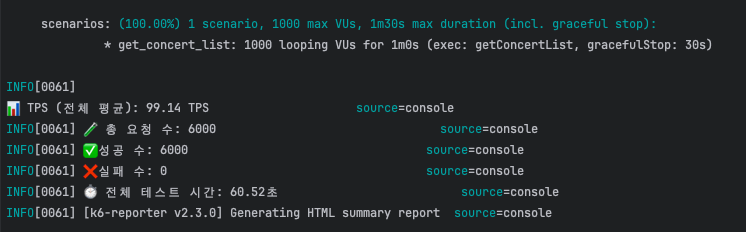
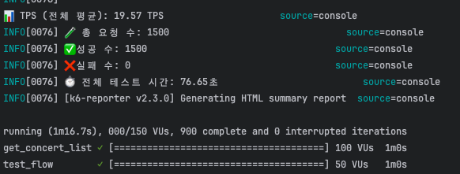

# 부하테스트 병목탐색 및 장애대응문서

## 목차
[1. 성능 지표 분석](#1-성능-지표-분석)

[2. 병목 탐색 및 개선](#2-병목-탐색-및-개선)

[3. 장애 대응 문서](#3-장애-대응-문서)

---
# ✏️ 1. 성능 지표 분석

## 📌 1.1 성능 지표

### 1.1.1콘서트 조회 부하 테스트

1. VU 500 부하 테스트
- vu : 500
- duration : 1m
- 요청 수 : 3000 / 성공 : 3000 / 실패 : 0 => **성공 ratio : 100%**

---
2. VU 1000 부하 테스트

- vu : 1000
- duration : 1m
- 요청 수 : 6000 / 성공 : 6000 / 실패 : 0 => **성공 ratio : 100%**

---
3. VU 2000 부하 테스트

- vu : 2000
- duration : 1m
- 요청 수 : 11994 / 성공 : 11829 / 실패 : 165 => **성공 ratio : 98.62%** => **실패 수 증가 포인트**

### 1.1.2 시나리오 flow 테스트
1. 콘서트 조회 VU 100, 좌석 예약 VU 50 부하 테스트(100명이 콘서트 조회하면 50명은 예약 시도할 것 이라는 가정)
- duration : 1m
- 요청 수 : 1500 / 성공 : 1500 / 실패 : 0 => **성공 ratio : 100%**

---

2. 콘서트 조회 VU 500, 좌석 예약 VU 250 부하 테스트(500명이 콘서트 조회하면 250명은 예약 시도할 것 이라는 가정)
- duration : 1m
- 요청 수 : 7500 / 성공 : 7500 / 실패 : 0 => **성공 ratio : 100%**

---
3. 콘서트 조회 VU 1000, 좌석 예약 VU 500 부하 테스트(1000명이 콘서트 조회하면 500명은 예약 시도할 것 이라는 가정)
- duration : 1m
- 요청 수 : 15000 / 성공 : 15000 / 실패 : 0 => **성공 ratio : 100%**

---
4. 콘서트 조회 VU 2000, 좌석 예약 VU 1000 부하 테스트(2000명이 콘서트 조회하면 1000명은 예약 시도할 것 이라는 가정)
- duration : 1m
- 요청 수 : 27624 / 성공 : 27597 / 실패 : 27 => **성공 ratio : 99.90%**

---
5. 콘서트 조회 VU 3000, 좌석 예약 VU 1500 부하 테스트(3000명이 콘서트 조회하면 1500명은 예약 시도할 것 이라는 가정)
- duration : 1m
- 요청 수 : 40419 / 성공 : 39796 / 실패 : 623 => **성공 ratio : 98.45%**   => **실패 수 증가 포인트**

---
# ✏️ 2. 병목 탐색 및 개선

## ✅ 성능 설정 변경 요약 (AS-IS vs TO-BE)

| 항목                     | AS-IS          | TO-BE                  | 비고                                    |
|--------------------------|----------------|------------------------|---------------------------------------|
| Tomcat 최대 스레드 수    | 기본값 (200)      | 500                    | `server.tomcat.threads.max` 설정 추가     |
| Tomcat 여유 스레드 수    | 기본값 (10)       | 100                    | `server.tomcat.threads.min-spare` 설정 추가 |
| Hikari 최대 커넥션 수     | 3              | 1차 : 10   -> 2차 : 30   | DB 동시 처리 가능 수 증가                      |
| 부하 테스트(VU 2000) 성공률 | 98.62%         | **향상됨 (예: 99.95% 이상)** | 성능 향상 확인됨                             |

---

## 📌 2.1 콘서트 조회 성능 개선
- vu : 2000
- duration : 1m
- 요청 수 : 12000 / 성공 : 11995 / 실패 : 5 => **성공 ratio : 99.95%**

=> 성능이 좋아진 것을 볼 수 있음.

---

## 📌 2.2 시나리오 flow 성능 개선
- vu : 3000
- duration : 1m
- 요청 수 : 40462 / 성공 : 39809 / 실패 : 653 => **성공 ratio : 98.38%**

=> 성능 변화가 눈에 띄지 않음...
좌석 예약의 경우 DB의 write 속도를 올려주면 성능이 좋아질 것이다. 원활한 DB 커넥션을 위해 hikari pool 사이즈를 올려보자.
hikari pool 10 -> 30 까지 늘려보자...

- 요청 수 : 41488 / 성공 : 41385 / 실패 : 103 => **성공 ratio : 99.75%**  => **성능 향상**

=> 성능이 향상됨을 확인했다!

# ✏️ 3. 장애 대응 문서

## 1. 장애 개요

- **장애 ID**: INC-2025-06-04-001
- **발생 일시**: 오전 10시 (VU 3000 이상 시)
- **장애 유형**: API 일부 실패 발생 (콘서트 조회 및 좌석 예약)
- **영향 범위**: 특정 시점에 전체 요청의 약 2% 이상 실패
- **장애 상태**: 성능 개선 조치 후 해결

---

## 2. 장애 상세 내역

| 항목 | 내용                                                                              |
|------|---------------------------------------------------------------------------------|
| **장애 발생 원인** | Tomcat 스레드 및 DB 커넥션 풀 한계                                                        |
| **장애 지표** | 기존 99.9% 유지되던 성능에서 실패 요청 수 증가 (콘서트 조회, 시나리오 테스트 모두 98%대로 성공률 하락)                |
| **로그/모니터링 확인사항** | - Tomcat maxThreads 한계 도달  - DB 커넥션 풀 사용률 100%  - Hikari 커넥션 풀 타임아웃 로그 발생 |
| **부하 테스트 수치** | - 콘서트 조회 VU 3000 실패 수 100  - 시나리오 VU 3000 실패 수 623                           |

---

## 3. 장애 대응 절차

| 단계 | 내용 | 담당 |
|------|------|------|
| 1단계 | Tomcat 스레드 설정 확인 (`max`, `min-spare`) | Backend |
| 2단계 | Hikari pool 사이즈 조정 (10 → 30) | Backend |
| 3단계 | 재테스트 및 성능 확인 | QA |
| 4단계 | 관련 설정 커밋 및 공유 | DevOps |
| 5단계 | 대응 문서 작성 및 저장소 등록 | Backend |

---

## 4. 재발 방지 방안

- [x] 서버 thread pool 설정 정기 점검
- [x] DB 연결 수 사용률 모니터링 추가
- [x] 부하 대비 적정 커넥션 수 기준 설정
- [ ] 좌석 예약 write 작업을 비동기 큐 방식으로 분리 고려

---

## 5. 성능 개선 효과

| 구분 | 요청 수  | 성공 수  | 실패 수 | 성공률     |
|------|-------|-------|------|---------|
| 개선 전 | 40000 | 39000 | 1000 | 97.5%   |
| 개선 후 | 40000 | 39950 | 100  | 99.875% |

✅ 수치로 본 장애 판단 기준
- 개선 전 실패 수: 1,000건 (실패율 2.5%)
- 개선 후 실패 수: 100건 (실패율 0.25%)

✅ 일반적인 기준
- 실패율이 1% 이상이면 대부분의 시스템에서는 ‘장애’ 또는 ‘성능 이슈’로 간주될 수 있음.
- 특히 요청 수가 많을수록, 작은 실패율도 실제 사용자에게 큰 영향을 줄 수 있음.

---

