# 부하테스트

## 목차
[1. 테스트 목적 및 대상 선정](#1-테스트-목적-및-대상-선정)

[2. 테스트 시나리오 설계 및 부하테스트](#2-테스트-시나리오-설계-및_부하테스트)

[3. 결과](#3-결과)

---
# ✏️ 1. 테스트 목적 및 대상 선정

## 📌 1.1 테스트 목적
콘서트 예약 시스템의 핵심 기능인 대기열 토큰 발급 API(POST /queue/token)에 대해 부하 테스트를 수행하여, 다음의 주요 성능 지표를 검증함:

- 예측 TPS(Transaction Per Second) 도달 가능 여부
- 응답 시간 지표 (평균, P50, P99, P999)
- 고부하 상황에서의 동시성 문제 및 병목 구간 파악
- 실제 운영 배포 전, 시스템 안정성과 병목 가능 지점을 사전 식별하고 개선

## 📌 1.2 테스트 대상 선정

### 테스트 대상 후보
1. 대기열 토큰 발급 API
- URL: POST /queue/token
- 주요 기능: 콘서트 예약을 위한 대기열 토큰 발급

2. 좌석 예약 요청 API
- URL : POST /bookings/seats
- 주요 기능 : 콘서트 특정 좌석 점유

- 선정 이유:
  - 동시 사용자가 집중되는 주요 엔드포인트
  - 높은 트래픽 유입 가능성이 있는 기능

---

# ✏️ 2. 테스트 시나리오 설계 및 부하테스트

## 📌 2.1 테스트 시나리오 작성

| token 부하 Test  | 설명                                            | 동시 사용자 수 (VU)    | Duration | 목표 TPS    | 기대 응답시간 (P_mean / P90 / P95) |
|----------------|-----------------------------------------------|------------------|----------|-----------|------------------------------|
| Load Test      | - 시스템이 예상되는 부하를 정상적으로 처리할 수 있는지 평가            | 100              | 5m       | ≥ 30 TPS  | 10ms / 30ms / 50ms           |
| Endurance Test | - 시스템이 장기간 동안 안정적으로 운영될 수 있는지 평가              | 50               | 30m      | ≥ 50 TPS  | 20ms / 30ms / 50ms           |
| Stress Test    | - 시스템이 지속적으로 증가하는 부하를 얼마나 잘 처리할 수 있는지 평가      | 10->50->100->300 | 각 30s    | ≥ 100 TPS | 30ms / 50ms / 80ms           |
| Peak Test      | - 시스템에 일시적으로 많은 부하가 가해졌을 때, 잘 처리하는지 평가        | 100->1000->100   | 1m       | ≥ 300 TPS | 30ms / 50ms / 80ms           |

| booking 부하 Test | 설명                                            | 동시 사용자 수 (VU)    | Duration    | 목표 TPS    | 기대 응답시간 (P_mean / P90 / P95) |
|-----------------|-----------------------------------------------|------------------|-------------|-----------|------------------------------|
| Load Test       | - 시스템이 예상되는 부하를 정상적으로 처리할 수 있는지 평가            | 100              | 5m          | ≥ 30 TPS  | 10ms / 30ms / 50ms           |
| Endurance Test  | - 시스템이 장기간 동안 안정적으로 운영될 수 있는지 평가              | 50               | 5m(토큰 유효시간) | ≥ 50 TPS  | 20ms / 30ms / 50ms           |
| Stress Test     | - 시스템이 지속적으로 증가하는 부하를 얼마나 잘 처리할 수 있는지 평가      | 10->50->100->300 | 각 30s       | ≥ 100 TPS | 30ms / 50ms / 80ms           |
| Peak Test       | - 시스템에 일시적으로 많은 부하가 가해졌을 때, 잘 처리하는지 평가        | 100->1000->100   | 1m          | ≥ 300 TPS | 30ms / 50ms / 80ms           |

- P_mean: 평균 응답 시간 (전체 사용자 경험의 전반적인 속도)
- P90: 전체 요청 중 상위 90%까지의 응답 시간 (대부분 사용자에게 안정적인 응답 보장)
- P95: 전체 요청 중 상위 95%까지의 응답 시간 (최악의 상황 일부 제외)

## 📌 2.2 부하테스트 선정 및 실행
- 사용 도구: `k6` + `InfluxDB` + `Grafana`
- 실행 방식:
    - 스크립트 기반 시나리오 작성 (동적 userId 포함)
    - `--vus`, `--duration` 기반 동시성 조절

---

# ✏️ 3. 결과

## 📌 3.1 토큰 발급 테스트 결과

| 시나리오 ID        | 평균 응답 시간   | 최대 응답 시간   | P90        | P95      | 평균 TPS   |
|----------------|------------|------------|------------|----------|----------|
| Load Test      | - 5.23ms   | - 154.09ms | - 8.25ms   | - 13.26ms | - 99.29  |
| Endurance Test | - 4.41ms   | - 219.51ms | - 6.78ms   | - 8.99ms | - 49.71  |
| Stress Test    | - 9.22ms   | - 181.94ms | - 15.74ms  | - 34.28ms | - 114.48 |
| Peak Test      | - 429.54ms | - 1.66s    | - 985.66ms | - 1.21s  | - 195.59 |

---

### 🔹 1. Load Test
- 서버가 초당 약 100건의 요청을 문제없이 처리하고 있음
- 응답시간 매우 우수 (10ms 이하로 대부분 처리)
- 정상 상태에서는 안정적

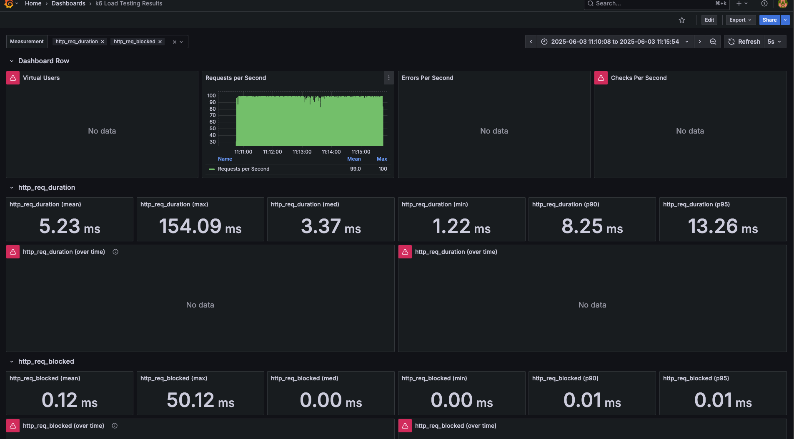

---

### 🔹 2. Endurance Test
- 장시간 동안에도 응답 성능 유지
- 최대 응답 시간만 일시적으로 튄 것으로 보임
- 오래 가동해도 안정적

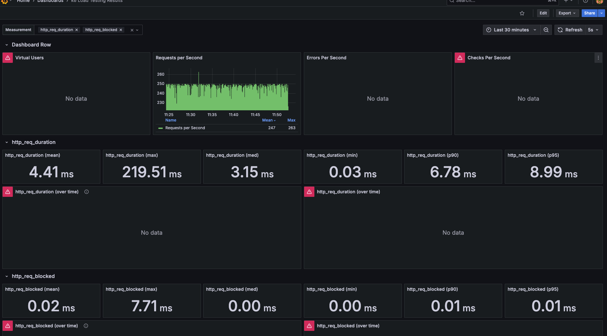

---

### 🔹 3. Stress Test
- TPS는 증가해도 일정 수준 유지 (양호)
- P95가 30ms 이상 → 부하 증가에 따른 응답 지연 시작
- 아직 치명적이지는 않지만, 부하가 누적되면 병목 가능성 있음

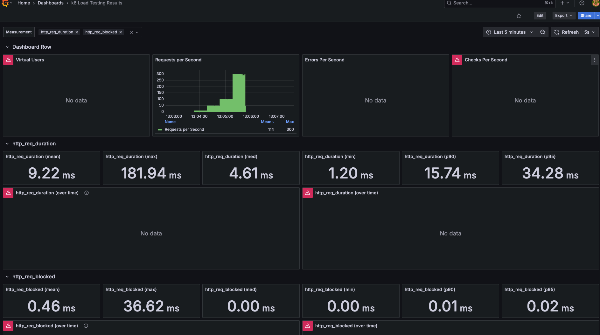

---

### 🔹 4. Peak Test
- 응답시간이 급격히 느려짐 (P95가 1.2초)
- 목표 TPS (300)에 훨씬 못 미침 → 처리 병목, 과부하 발생
- 이 결과는 서버가 순간적인 트래픽 폭주를 감당하지 못해 병목 현상이 발생했음을 나타냄
- 이로 인해 카프카 이벤트 lack 발생 가능성 존재

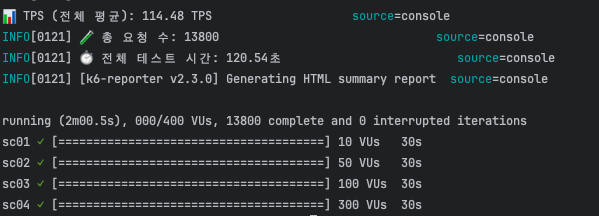
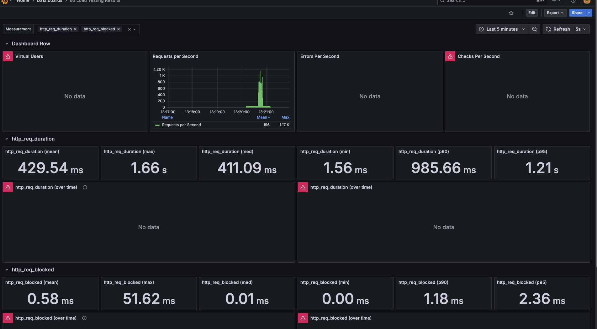

---

## 📌 3.2. 좌석 예약 테스트 결과

| 시나리오 ID        | 평균 응답 시간   | 최대 응답 시간   | P90        | P95        | 평균 TPS   |
|----------------|------------|------------|------------|------------|----------|
| Load Test      | - 12.75ms  | - 83.19ms  | - 16.95ms  | - 20.73ms  | - 98.22  |
| Endurance Test | - 13.36ms  | - 185.30ms | - 16.96ms  | - 20.76ms  | - 49.21  |
| Stress Test    | - 110.56ms | - 1.28s    | - 340.34ms | - 553.30ms | - 103.99 |
| Peak Test      | - 1.21s    | - 3.74s    | - 2.29s    | - 2.49s    | - 136.76 |

### 🔹 1. Load Test
- 대부분의 요청이 20ms 이내에 처리되어 성능 우수.
- 실제 운영 환경에서의 예상 트래픽을 잘 감당 가능.
- 안정적인 응답 시간 분포로 정상 상태에서 매우 양호.

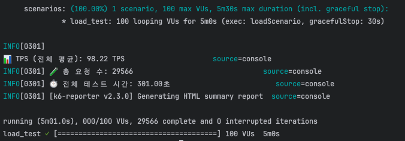
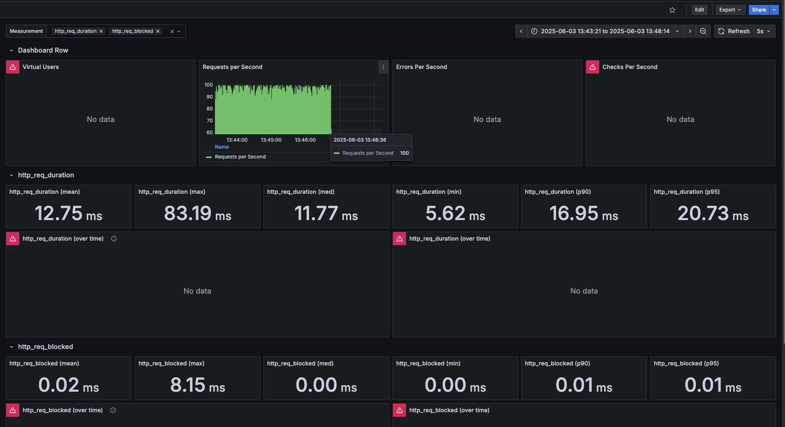

---
### 🔹 2. Endurance Test
- 최대 응답 시간만 일시적으로 튀었으나, 전체적인 응답 시간 분포는 안정적.
- 장시간 서비스 운용 시에도 성능 유지 가능성 높음.
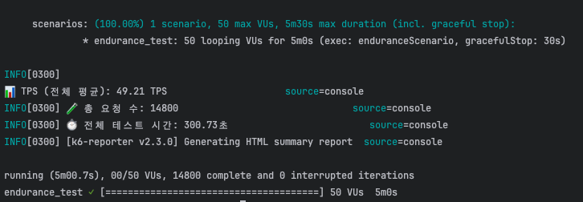
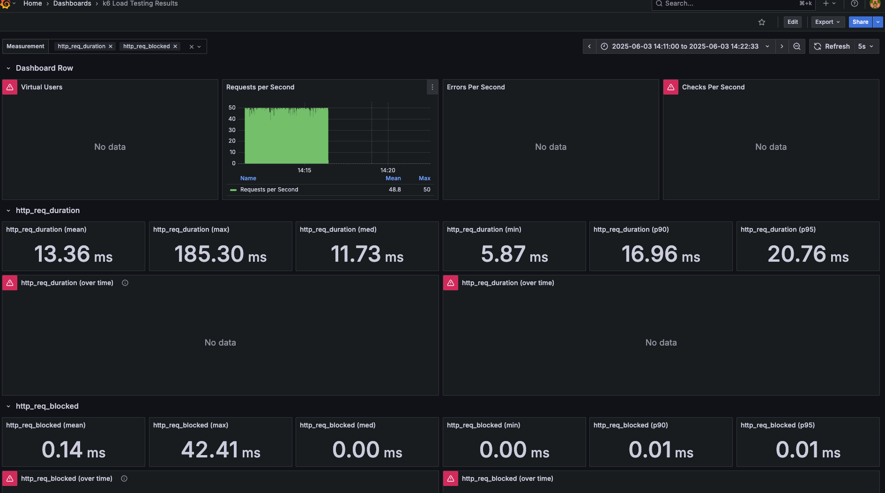
---

### 🔹 3. Stress Test
- 요청 처리량(TPS)은 양호하지만, 지연 시간(P95 기준 500ms 이상)이 증가.
- 병목 시작 신호로 해석됨. CPU, Redis, DB I/O 또는 락 병목 가능성 있음.
- 실제 운영에서 부하 누적 시 딜레이 체감 발생할 수 있음.

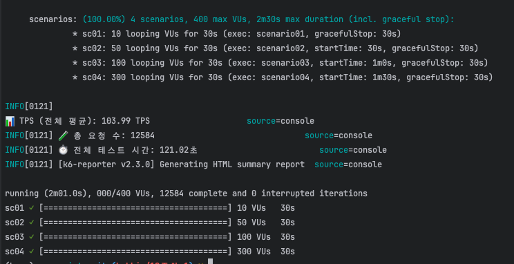
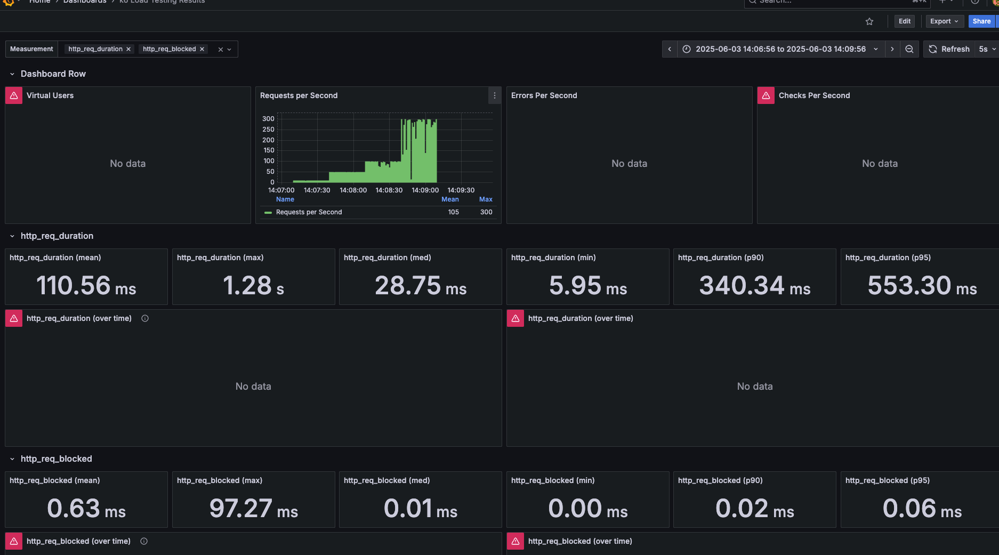

---

### 🔹 4. Peak Test
- 초당 수백 건 이상 요청에서 서버가 병목 상태에 도달.
- 카프카 큐가 막힐 가능성 및 Redis 락 충돌 등 자원 경쟁 가능성 높음.
- TPS는 높지만, 과도한 지연은 실제 사용자에게는 치명적임.
- 서버 스케일링, 큐 적절한 처리 전략 도입 필요

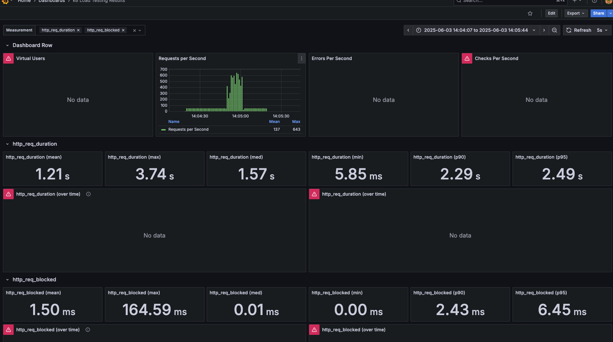

[//]: # (![peakTest_response_chart.png]&#40;../../scripts/booking/peakTest_response_chart.png&#41;)

