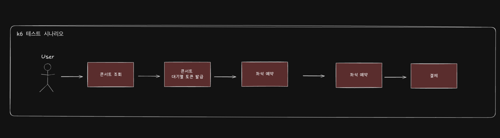
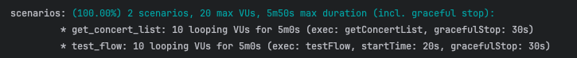
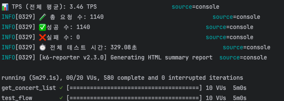
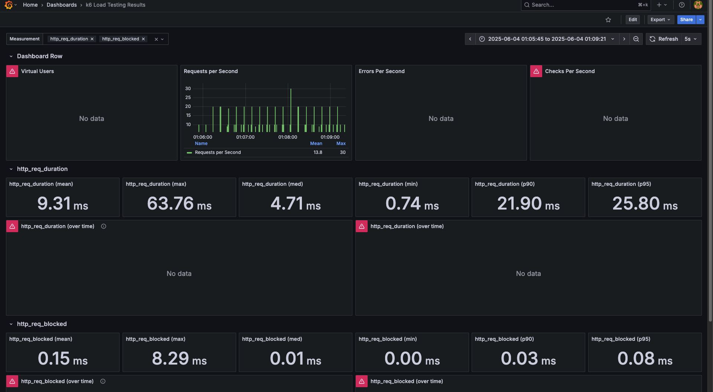
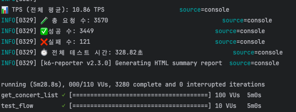
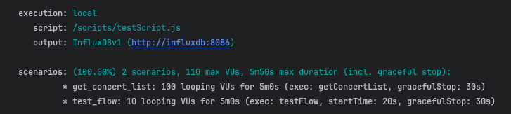
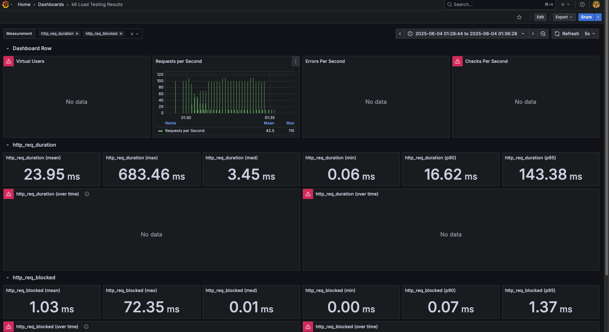
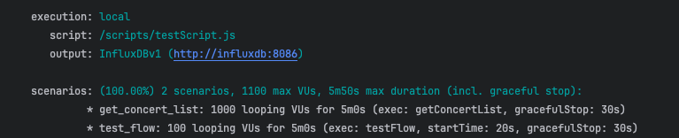
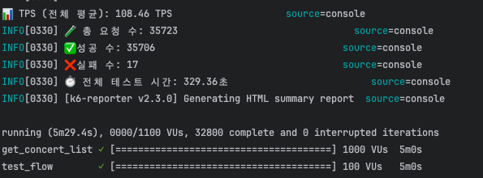
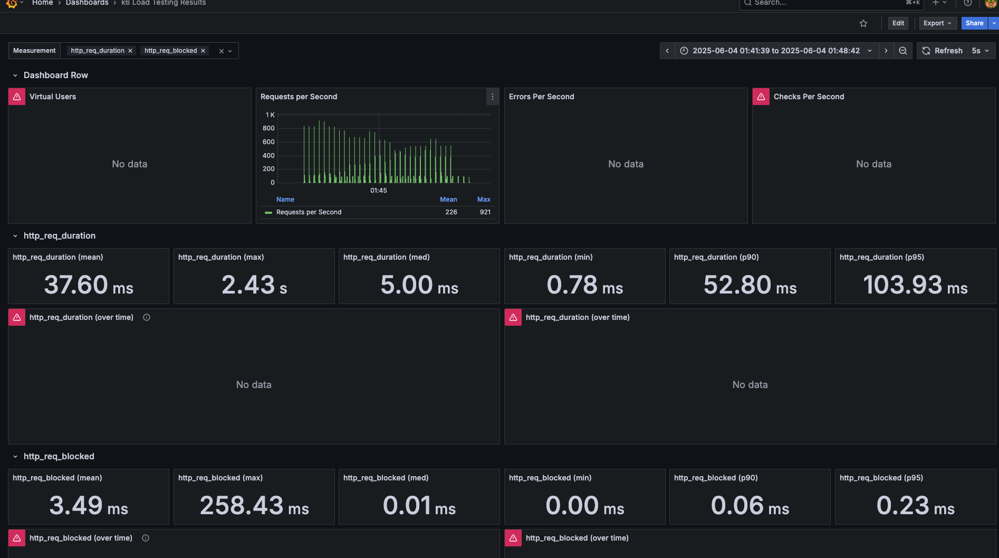

# 부하테스트 시나리오 작성

## 목차
[1. 테스트 목적 및 대상 선정](#1-테스트-목적-및-대상-선정)

[2. 테스트 시나리오 설계 및 부하테스트](#2-테스트-시나리오-설계-및_부하테스트)

[3. 결과](#3-결과)

---
# ✏️ 1. 테스트 목적 및 대상 선정

## 📌 1.1 테스트 목적
콘서트 예약 시스템의 핵심 기능인 대기열 토큰 발급 API(POST /queue/token)에 대해 부하 테스트를 수행하여, 다음의 주요 성능 지표를 검증함:

- 예측 TPS(Transaction Per Second) 도달 가능 여부
- 응답 시간 지표 (평균, P90 ,p95)
- 고부하 상황에서의 동시성 문제 및 병목 구간 파악
- 실제 운영 배포 전, 시스템 안정성과 병목 가능 지점을 사전 식별하고 개선

## 📌 1.2 최종 시나리오 flow

---

# ✏️ 2. 테스트 시나리오 설계 및 부하테스트

## 📌 2.1 테스트 시나리오 작성

### 시나리오 부하 테스트 목표치 선정

| 시나리오 테스트 | 설명                                    | 동시 사용자 수 (VU) | 목표 TPS                      | 기대 응답시간 (P90 / P95) |
|----------|---------------------------------------|---------|-----------------------------|---------------------|
| 콘서트 조회   | - Redis / DB 조회                       | 1000    | 1000(VU) * 0.1(s) = 100 TPS | 30ms / 100ms        |
| 토큰 발급    | - 유저 토큰 발급 이벤트 발행(kafka)              | 500     | 500(VU) * 0.1(s) = 50 TPS   | 100ms / 200ms       |
| 좌석 예약    | - 좌석 예약 db 저장 / 콘서트 예약 score redis 저장 | 500     | 500(VU) * 0.1(s) = 50 TPS   | 100ms / 200ms       |
| 결제       | - 결제 db 저장                            | 300     | 300(VU) * 0.1(s) = 30 TPS   | 100ms / 200ms       |

- P_mean: 평균 응답 시간 (전체 사용자 경험의 전반적인 속도)
- P90: 전체 요청 중 상위 90%까지의 응답 시간 (대부분 사용자에게 안정적인 응답 보장)
- P95: 전체 요청 중 상위 95%까지의 응답 시간 (최악의 상황 일부 제외)

## 📌 2.2 부하테스트 선정 및 실행
- 사용 도구: `k6` + `InfluxDB` + `Grafana`
- 실행 방식:
    - 스크립트 기반 시나리오 작성 (동적 userId 포함)
    - `--vus`, `--duration` 기반 동시성 조절

---

# ✏️ 3. 결과

## 📌 3.1 토큰 발급 테스트 결과

- VU : 10 / duration : 5m

- VU : 100 / duration : 5m

- VU : 1000 / duration : 5m

---

---

## 📌 3.2. 좌석 예약 테스트 결과

### VU 별 성능 테스트 요약 비교
| 항목           | VU: 10       | VU: 100           | VU: 1000             |
|----------------|--------------|-------------------|----------------------|
| 평균 응답 시간 | 🟢 매우 빠름 (9.31ms) | 🟢 양호 (23.95ms)   | 🔴 느림 (1.21s)         |
| 최대 응답 시간 | 63.76ms      | 683.46ms          | 3.74s                |
| P90 응답 시간  | 21.90ms      | 16.62ms           | 2.29s                |
| P95 응답 시간  | 25.80ms      | 143.38ms          | 2.49s                |
| 평균 TPS       |  낮음 (3.46) |  증가 (10.86)     |  매우 높음 (108.46) |
| 안정성         | 안정적       |  일부 지연 발생    |  고부하 병목 발생     |
| 개선 필요 여부 |  없음        | 🔍 지연 원인 분석 필요 | ✅ 병목 최적화 필요      |
