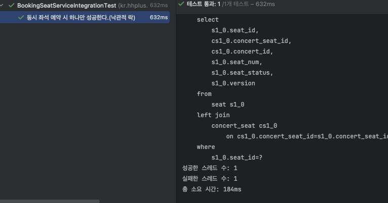
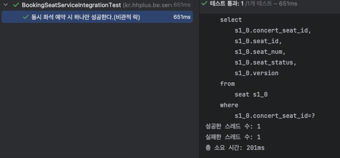
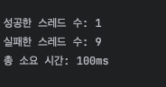
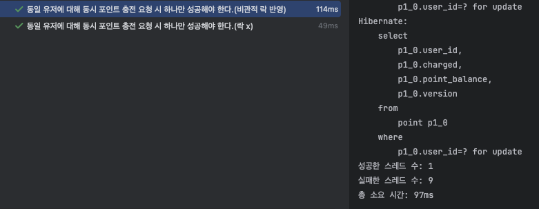

# 🎟️ 동시성 이슈 보고서

## 📌 동시성 이슈 발생 지점 선별
- **좌석 선점(예약)**
- **유저 포인트 잔액**

---

# ✏️ 1. 문제 식별 - 좌석 선점(예약)

### 📌 개요

본 애플리케이션은 다수의 사용자가 콘서트 좌석을 예약할 수 있는 시스템이다. 동시에 여러 사용자가 동일한 좌석을 예약하려는 상황이 발생할 수 있으며, 이러한 경우 **동시성 제어가 적절하지 않으면 동일 좌석이 중복 예약**되는 문제가 발생할 수 있다.

### 📌 발생한 이슈
동일한 유저가 동시에 여러 번 좌석 점유 요청을 보내는 경우, 트랜잭션 내에서 좌석 상태를 조회하고 점유하는 과정에서 동시성 문제가 발생할 수 있다.
이 경우, 여러 스레드가 해당 좌석 상태를 동시에 조회하고 업데이트하려 할 때, Race Condition이 발생할 가능성이 있다.
아래는 3개의 스레드가 동시에 동일한 좌석을 예약 요청한 테스트 코드이다.

```java
  @DisplayName("동일 좌석 동시 예약 요청 시 하나만 성공해야 한다.(락x)")
  @Test
  void testConcurrencyBookingSeatTest() throws InterruptedException {
    int threadCount = 10;
    ExecutorService executorService = Executors.newFixedThreadPool(threadCount);
    CountDownLatch latch = new CountDownLatch(threadCount);

    //future로 비동기 작업 받을 수 있게 처리
    List<Future<ResponseMessage<BookingResponse>>> results = new ArrayList<>();

    for (int i = 0; i < threadCount; i++) {
        Future<ResponseMessage<BookingResponse>> result = executorService.submit(() -> {
            try {
                return bookingService.bookingSeat(bookingRequest);
            } catch (Exception e) {
                return ResponseMessage.error(500, e.getMessage());
            } finally {
                latch.countDown();
            }
        });
        results.add(result);
    }


      latch.await(); // 모든 스레드 완료까지 대기

      long successCount = results.stream()
              .filter(future -> {
                  try {
                      return future.get().getStatus() == 200;
                  } catch (Exception e) {
                      return false;
                  }
              })
              .count();

      long failCount = results.stream()
              .filter(future -> {
                  try {
                      return future.get().getStatus() != 200;
                  } catch (Exception e) {
                      return true;
                  }
              })
              .count();

      System.out.println("성공한 예약 요청 수: " + successCount);
      System.out.println("실패한 예약 요청 수: " + failCount);

      // 기대: 성공 1건
      assertEquals(1, successCount);
  }
  
```
### 📌 테스트 결과
기대 결과 vs 실제 결과

| 항목 | 기대값 | 실제값 |
|------|-----|-----|
| 성공 요청 수 | 1   | 2   |
| 실패 요청 수 | 9   | 8   |
| 좌석 중복 예약 여부 | 없음  | 있음  |


📌 왜 10개 모두 성공하지 못했는가?

| 이유 | 설명                               | 
|------|----------------------------------|
| Race Condition | 3개의 스레드가 동시에 실행되며 모두 조건을 통과함     |
| 타이밍 차이 | 그 중 2개가 더 빨리 저장을 마쳤고, 8개는 늦게 시도함 |
| 동시성 제어 없음 | 락이 없으니 트랜잭션 간 데이터 충돌을 감지 못함      |
| 결과 | 2개는 성공, 8개는 실패 → 의도한 동작이 아님!     |


---
## 문제 분석

### 📌 코드 흐름 요약

1. **Seat 조회**: `concertId`와 `seatNum`을 기준으로 좌석을 조회합니다.
2. **예약 가능 여부 확인**: `booking.isAvailableBooking()`을 통해 예약 가능한 좌석인지 확인합니다.
3. **좌석 상태 변경**: 예약이 가능하다면, 좌석 상태를 `OCCUPIED`로 변경합니다.
4. **예약 처리**: `bookingRepository.save()`를 통해 예약 정보를 저장합니다.

Seat 조회 → 예약 가능 여부 판단 → 상태 변경 → 저장 순으로 동작

이 로직은 트랜잭션으로 묶여 있으나, 조회와 저장 사이의 타이밍 간격에서 Race Condition이 발생할 수 있다.

---

### 📌 이슈 발생 원인

- 여러 스레드가 동시에 동일한 Seat 엔티티를 조회
- 각각 상태가 AVAILABLE인 것을 확인하고 조건을 통과
- 거의 동시에 상태를 OCCUPIED로 변경하고 저장
- 그 결과, 여러 건의 예약이 성공해버리는 중복 예약 발생

특히 하나의 요청은 다른 요청보다 늦게 커밋되면서, 이미 OCCUPIED가 된 좌석을 보고 실패한 것으로 추정된다.
이 과정에서 Race Condition이 발생하고, 이는 동시성 문제가 발생한다.


---

### 📌 동시성 이슈 해결 방안

### AS-IS

| 구분        | 내용                            | 
|-----------|-------------------------------|
| 트랜잭션 관리	  | 있음 (@Transactional)           |
| 동시성 제어	   | 없음                            | 
| 발생 가능 문제	   | 중복 좌석 선점, Race Condition 
|


### TO-BE (낙관적 락 vs 비관적 락)

**낙관적 락 적용**
- Seat 엔티티에 @Version 필드 추가
- JPA가 자동으로 충돌 시 OptimisticLockException 발생

```java
@DisplayName("동시 좌석 예약 시 하나만 성공한다.(낙관적 락)")
@Test
 void bookingSeatOptimisticLockTest() throws InterruptedException {
    User user1 = bookingTransactionHelper.createUser(1L);
    User user2 = bookingTransactionHelper.createUser(2L);

    Queue queue1 = bookingTransactionHelper.createQueue(user1);
    Queue queue2 = bookingTransactionHelper.createQueue(user2);

    BookingRequest request1 = new BookingRequest(bookingRequest.getConcertId(), 1L, user1.getUserId());
    BookingRequest request2 = new BookingRequest(bookingRequest.getConcertId(), 1L, user2.getUserId());

    ExecutorService executor = Executors.newFixedThreadPool(2);
    List<Future<ResponseMessage<BookingResponse>>> futures = new ArrayList<>();

    futures.add(executor.submit(() -> bookingService.bookingSeat(request1)));
    futures.add(executor.submit(() -> bookingService.bookingSeat(request2)));

    int successCount = 0;
    int failCount = 0;

    for (Future<ResponseMessage<BookingResponse>> future : futures) {
        try {
            ResponseMessage<BookingResponse> response = future.get();
            if (response.getStatus() == 200) {
                successCount++;
            } else {
                failCount++;
            }
        } catch (ExecutionException e) {
            Throwable cause = e.getCause();
            if (cause instanceof ObjectOptimisticLockingFailureException) {
                failCount++;
            } else {
                throw new RuntimeException("Unexpected exception", cause);
            }
        }
    }

    executor.shutdown();
    executor.awaitTermination(5, TimeUnit.SECONDS);

    System.out.println("성공한 스레드 수: " + successCount);
    System.out.println("실패한 스레드 수: " + failCount);

    assertEquals(1, successCount);
    assertEquals(1, failCount);
}

public class Seat {

  @Id
  @GeneratedValue(strategy = GenerationType.IDENTITY)
  @Schema(description = "좌석 ID", example = "1")
  private Long seatId;

  @ManyToOne
  @JsonIgnore
  @JoinColumn(name = "concert_seat_id")
  @Schema(description = "콘서트좌석", example = "1")
  private ConcertSeat concertSeat;

  @Schema(description = "좌석 번호", example = "1")
  private Long seatNum;

  @Schema(description = "좌석 상태", example = "AVAILABLE")
  @Enumerated(EnumType.STRING)
  @Column(name = "seat_status", length = 10)
  private SeatStatus seatStatus;

  @Version
  private Long version; // 낙관적 락 적용 위한 version 필드 추가
}
```

#### 적용 결과



#### 📌 장단점

- 장점
  - 동시 접근 완전 차단. 무조건 선착순 보장
  - 충돌 재시도 로직 불필요 → 처리 간결
- 단점
  - 여러 테이블/좌석 동시 접근 시 데드락 위험
  - 트래픽이 많아질수록 병목 가능성 커짐


**비관적 락 적용**

```java
@Transactional
public ResponseMessage<BookingResponse> bookingSeatWithPessimisticLock(BookingRequest bookingRequest) {

    //활성화 상태의 토큰이 조회되지 않거나 || 해당 유효 기간(만료기간)이 현재시간보다 지난 경우 -> 서비스 불가
    Optional<Queue> activeToken = queueRepository.findByUserIdAndTokenStatus(bookingRequest.getUserId(), TokenStatus.ACTIVE);

    if (activeToken.isEmpty() || activeToken.get().getExpiredAt().isBefore(LocalDateTime.now())) {
        throw new IllegalStateException("유효한 대기열 토큰이 존재하지 않습니다.");
    }

    // 1. concertId로 Concert 객체 조회 / userId로 UserId 객체 조회 / seat 정보 조회
    Concert concert = concertRepository.findById(bookingRequest.getConcertId())
            .orElseThrow(() -> new RuntimeException("해당 콘서트를 찾을 수 없습니다."));

    User user = userRepository.findById(bookingRequest.getUserId())
            .orElseThrow(() -> new EntityNotFoundException("유저 정보가 없습니다."));

    Seat seat = seatRepository.findByConcertIdAndSeatNumWithLock(bookingRequest.getConcertId(), bookingRequest.getSeatNum())
            .orElseThrow(() -> new EntityNotFoundException("해당 좌석을 찾을 수 없습니다."));  // seat 조회 시 비관적 락 적용

    // 2. Booking 도메인 객체 생성
    Booking booking = new Booking(concert, bookingRequest.getSeatNum(), user);

    // 3. 예약 가능 여부 확인
    //  booking의 seatNum의 좌석 점유 여부 체크
    if (!booking.isAvailableBooking()) {
        return ResponseMessage.error(500, "선택 좌석은 예약 불가능한 좌석입니다.");

    } else {
        //좌석 점유 처리
        seat.setSeatStatus(SeatStatus.OCCUPIED);
        seatRepository.save(seat);

        // booking 예약 처리
        bookingRepository.save(booking);
    }

    BookingResponse bookingResponse = new BookingResponse();
    bookingResponse.setConcertId(concert.getConcertId());
    bookingResponse.setConcertName(concert.getName());
    bookingResponse.setSeatNum(seat.getSeatNum());

    return ResponseMessage.success("좌석 예약이 완료됐습니다.", bookingResponse);
}

@Override
public Optional<Seat> findByConcertIdAndSeatNumWithLock(Long concertId, Long seatNum) {
  try {
    Seat seat = em.createQuery(
                    "SELECT s FROM Seat s WHERE s.concertSeat.concert.concertId = :concertId AND s.seatNum = :seatNum", Seat.class)
            .setParameter("concertId", concertId)
            .setParameter("seatNum", seatNum)
            .setLockMode(LockModeType.PESSIMISTIC_WRITE)
            .getSingleResult();
    return Optional.of(seat);
  } catch (NoResultException e) {
    return Optional.empty();
  }
}
```

#### 적용 결과



### 📌 장단점

- 장점
  - 락을 점유하지 않으니 데드락 위험이 없음
  - 락을 걸지 않으므로 동시 처리량이 높음
- 단점
  - 변경 충돌 발생 시 예외 처리 필요 (OptimisticLockingFailureException)
  - 동시 예약 시 실패 확률 있음 → 재시도 로직 필요

---
## 3. AS-IS / TO-BE 비교

| 항목                | AS-IS (기존)                      | TO-BE (Optimistic)                              | TO-BE (Pessimistic)                            |
|---------------------|-----------------------------------|-------------------------------------------------|------------------------------------------------|
| 동시성 제어         | ❌ 없음                           |  버전 기반 제어                                 |  DB 락 기반 제어                                |
| 처리 방식           | 병렬 → 충돌 가능                   | 병렬 → 충돌 시 예외 발생 → 재시도 필요              | 직렬 → 대기 발생 가능                            |
| 충돌 처리           | ❌ 미처리                          |  재시도 로직 필요                               |  충돌 없음                                    |
| 성능                |  빠름 (충돌 시 위험)              |  충돌 없으면 빠름                               |  느릴 수 있으나 안정적                          |
| 구현 난이도         |  단순                            |  재시도 로직 필요                                |  락 범위/순서 설계 필요                        |
| 데이터 정합성       | ❌ 불안정                          |  충돌 시 실패 가능                               |  강력한 정합성 보장                             |

### 어떤 전략이 더 타당한가?

#### 🔍 좌석 점유 기능의 특성

| 요소                    | 내용                                                     |
|-------------------------|----------------------------------------------------------|
| 중요도                  | 🎫 인기 공연 좌석 확보에 직결되는 주요 기능             |
| 충돌 가능성             | 동시에 여러 사용자가 같은 좌석을 선택할 수 있음          |
| 데이터 정합성 요구 수준 | 매우 높음 (한 좌석은 반드시 한 명에게만 할당되어야 함)  |
| 사용자 기대             | 선착순 기반 예약 → **내가 먼저 누르면 예약돼야 함**     |
| 트래픽/성능 요구         | 공연 오픈 시점에는 급격한 트래픽 발생 가능               |


✅ 결론: 낙관적 락(Optimistic Locking) 전략 채택

- 인기 공연일수록 **동시 요청 충돌 가능성은 존재**하지만, 전체 요청 대비 **실제 충돌 비율은 제한적**.
- **비관적 락**을 사용할 경우, 모든 사용자가 순차적으로 락을 대기하므로 → **예약 처리 속도 저하**, 사용자 경험 저해.
- 또한, 비관적 락은 동시에 들어온 요청을 순차 처리하여 **모두 성공시킬 수 있으나**, 좌석 점유는 "한 좌석, 한 유저" 원칙이므로 **낙관적 락으로 하나만 성공시키는 게 더 타당**.
- 따라서, 충돌 시 예외를 발생시키고, 사용자에게 재시도 안내를 하는 방식으로 처리.
- 성능 최적화를 고려하며, **낙관적 락 + 재시도 로직 기반 전략으로 구현 결정**.

---


# ✏️ 2. 문제 식별 - 유저 포인트 잔액

### 📌 개요
본 애플리케이션은 유저가 포인트를 충전할 수 있는 기능을 제공한다. 유저가 포인트를 충전하려고 할 때, 트랜잭션 내에서 포인트 잔액을 조회하고 업데이트하는 작업이 이루어진다. 하지만, 동일한 유저가 동시에 여러 번 포인트 충전 요청을 보낼 경우, 동시성 문제가 발생할 수 있다. 특히, 중복된 요청이 있을 경우, 여러 스레드가 동시에 같은 유저의 포인트를 수정하려 할 때, 포인트가 중복으로 충전되는 문제가 발생할 수 있다.

### 📌 발생한 이슈
동일한 유저가 동시에 여러 번 포인트 충전 요청을 보내는 경우, 트랜잭션 내에서 포인트를 조회하고 충전하는 과정에서 동시성 문제가 발생할 수 있다. 이 경우, 여러 스레드가 같은 유저의 포인트 잔액을 동시에 조회하고 업데이트하려 할 때, Race Condition이 발생할 가능성이 있다. 특히, 하나의 스레드가 포인트를 조회하고 업데이트한 후, 다른 스레드도 동일한 정보를 조회하여 중복된 포인트 충전을 진행하는 상황이 발생할 수 있다.

### 📌 예시 시나리오:
1. 유저 A가 100,000포인트를 충전하려는 요청을 보낸다.
2. 동시에 네트워크 문제나 UI 지연으로 같은 요청이 두 번 서버에 도달한다.
3. 두 요청이 거의 동시에 처리되며, 포인트 잔액을 중복으로 증가시키게 된다.


### 📌 테스트 결과

 기대 결과 vs 실제 결과

| 항목        | 기대값 | 실제값 |
|-----------|-----|-----|
| 성공 요청 수   | 1   | 10  |
| 실패 요청 수   | 9   | 0   |
| 중복 포인트 충전 | 없음  | 있음  |


## 문제 분석

### 📌 코드 흐름 요약
현재의 포인트 충전 로직에서는 다음과 같은 순서로 작업이 처리된다:
1. 포인트 조회: pointRepository.findById(userId)를 통해 유저의 현재 포인트 잔액을 조회.
2. 포인트 충전: chargePoint() 메서드가 호출되어 포인트 잔액을 증가시킴.
3. 포인트 저장: 변경된 포인트 잔액을 pointRepository.save(point)를 통해 저장.

이 로직에서는 조회 후 업데이트가 이루어지며, 트랜잭션으로 묶여 있지만, 포인트 조회와 업데이트 사이에 다른 스레드가 개입할 수 있다. 
여러 스레드가 동시에 동일한 유저에 대해 포인트를 조회하고 업데이트하면, 중복된 충전이 발생할 수 있다.

```java
@Override
@Transactional
public ResponseMessage<PointResponse> chargePoint(PointChargeRequest pointChargeRequest) {

    Point point = pointRepository.findById(pointChargeRequest.getUserId())
            .orElseThrow(() -> new EntityNotFoundException("포인트 정보가 없습니다."));
    
    //충전 호출
    point.chargePoint(pointChargeRequest);
    
    //충전 저장
    pointRepository.save(point);
    
    PointResponse pointResponse = PointResponse.builder()
            .pointBalance(point.getPointBalance())
            .build();
    
    return ResponseMessage.success("포인트가 정상적으로 충전됐습니다.", pointResponse);
}
```

### 📌 이슈 발생 원인
1. 동시성 문제: 여러 스레드가 동시에 **pointRepository.findById()**로 포인트를 조회하고, chargePoint() 메서드를 호출하여 포인트를 수정하려 시도.
2. Race Condition: 두 스레드가 거의 동시에 포인트 잔액을 증가시켜, 포인트가 중복으로 충전되는 현상이 발생.
3. 트랜잭션 관리 부족: 비록 트랜잭션 내에서 작업을 처리하지만, 동일 유저에 대한 포인트 충전 작업이 중복되도록 막는 제어가 부족하다.

---

### 📌 동시성 이슈 해결 방안

### AS-IS

| 구분        | 내용                            | 
|-----------|-------------------------------|
| 트랜잭션 관리	  | 있음 (@Transactional)           |
| 동시성 제어	   | 없음                            | 
| 발생 가능 문제	   | 중복 충전, 잔액 불일치, Race Condition 
|


### TO-BE (낙관전 락 vs 비관적 락)

**낙관적 락 적용**
  - Point 엔티티에 @Version 필드 추가
  - JPA가 자동으로 충돌 시 OptimisticLockException 발생

```java
@Entity
public class Point {

    @Id
    private Long userId;

    @OneToOne(fetch = FetchType.LAZY)
    @MapsId
    @JoinColumn(name = "user_id", nullable = false, unique = true)
    private User user;


    @Schema(description = "포인트 잔액", example = "10000")
    @JsonProperty("pointBalance")
    private Long pointBalance;
    
    @Version
    private Long version; // 버전 관리 위해 version 추가
}
```
#### 📌 적용 결과


```java
//낙관적 락 반영 메서드
@Override
public ResponseMessage<PointResponse> chargePointWithLock(PointChargeRequest pointChargeRequest) {
  try {
    return chargePoint(pointChargeRequest);

  } catch (ObjectOptimisticLockingFailureException e) {
    log.error("충전 실패: Optimistic Lock 예외 발생", e);
    throw e;
  }
}

/**
 * @description 유저의 포인트를 충전한다.
 * @param pointChargeRequest
 * @return
 */
@Override
@Transactional(propagation = Propagation.REQUIRES_NEW)
public ResponseMessage<PointResponse> chargePoint(PointChargeRequest pointChargeRequest) {

  //현재 잔액 조회
  Point point = pointRepository.findById(pointChargeRequest.getUserId())
          .orElseThrow(() -> new EntityNotFoundException("포인트 정보가 없습니다."));

  if (point.isCharged()) {
    throw new IllegalStateException("이미 충전된 요청입니다.");
  }

  //충전 호출
  point.chargePoint(pointChargeRequest);

  //충전 저장
  pointRepository.save(point);

  point.setCharged(true);

  PointResponse pointResponse = PointResponse.builder()
          .pointBalance(point.getPointBalance())
          .build();

  return ResponseMessage.success("포인트가 정상적으로 충전됐습니다.", pointResponse);
}
}
```

### 📌 장단점

- 장점
  - 락을 직접 걸지 않아 성능 저하가 적다.
  - 대부분의 경우 충돌 없이 빠르게 처리됨.
- 단점
  - 충돌 발생 시 예외 발생 -> 재시도 로직 필요
  - 반복 요청이 많을 경우 처리 실패율 증가 가능


**비관적 락 적용**
- 조회 시 Pessimistic Lock 걸기
- 비관적 락의 경우 동시 요청은 처리중인 스레드를 제외하고 락을 걸고, 대기한 후에 순차적으로 처리되므로 모든 요청이 성공한다. 포인트 충전의 경우 모든 요청이 성공하면 안되고 중복 방지를 위한 락 처리를 해야하므로 비관적 락을 사용할 경우엔 '이미 충전된 요청'임을 알 수 있도록 예외처리를 추가한다.

```java
@Lock(LockModeType.PESSIMISTIC_WRITE)
@Query("SELECT p FROM Point p WHERE p.userId = :userId")
Optional<Point> findByUserIdWithLock(@Param("userId") Long userId);

@Transactional
public ResponseMessage<PointResponse> chargePointWithPessimisticLock(PointChargeRequest pointChargeRequest) {

  // 비관적 락을 사용하여 현재 포인트 정보 가져오기
  Point point = pointRepository.findByUserIdForUpdate(pointChargeRequest.getUserId())
          .orElseThrow(() -> new EntityNotFoundException("포인트 정보가 없습니다."));

  // 이미 충전된 요청일 경우 예외처리
  if (point.isCharged()) { // 충전 상태를 체크하는 로직
    throw new IllegalStateException("이미 충전된 요청입니다.");
  }

  // 충전 호출
  point.chargePoint(pointChargeRequest);

  // 충전 상태를 업데이트 (중복 충전을 방지하기 위해 플래그 업데이트)
  point.setCharged(true);

  // 포인트 정보 저장
  pointRepository.save(point);

  // 충전 후 응답 반환
  PointResponse pointResponse = PointResponse.builder()
          .pointBalance(point.getPointBalance())
          .build();

  return ResponseMessage.success("포인트가 정상적으로 충전됐습니다.", pointResponse);
}
```

#### 적용 결과


  
### 📌 장단점

- 장점
    - 한 번에 하나의 트랜잭션만 데이터 수정 가능 → 충돌 없음
    - 충돌 재시도 로직 불필요 → 처리 간결
- 단점
    - 트랜잭션 대기 시간 발생 → 응답 지연
    - Deadlock 가능성 → 락 범위 및 순서 조심해야 함
    - 모든 요청이 성공하므로 이를 방지하기 위한 추가 로직 필요
---

### 3. AS-IS / TO-BE 비교

| 항목                | AS-IS (기존)                      | TO-BE (Optimistic)                              | TO-BE (Pessimistic)                           |
|---------------------|-----------------------------------|-------------------------------------------------|-----------------------------------------------|
| 동시성 제어         | ❌ 없음                           |  버전 기반 제어                                 |  DB 락 기반 제어                               |
| 처리 방식           | 병렬 → 충돌 가능                   | 병렬 → 충돌 시 예외 발생 → 재시도 필요              | 직렬 → 대기 발생 가능                           |
| 충돌 처리           | ❌ 미처리                          |  재시도 로직 필요                                |  충돌 없음                                   |
| 성능                |  빠름 (충돌 시 위험)              |  충돌 없으면 빠름                                |  느릴 수 있으나 안정적                          |
| 구현 난이도         |  단순                            |  재시도 로직 필요                                | 락 범위/순서 설계 필요                         |
| 데이터 정합성       | ❌ 불안정                          |  충돌 시 실패 가능                               |  강력한 정합성 보장                            |

---
### 어떤 전략이 더 타당한가?

#### 🔍 포인트 충전 기능의 특성

| 요소                  | 내용                                           |
|-----------------------|------------------------------------------------|
| 중요도                | 💥 유저 자산에 관련된 중요한 기능              |
| 충돌 가능성           | 중복 요청 등으로 인해 충돌 발생 가능           |
| 데이터 정합성 요구 수준 | 매우 높음                                      |
| 사용자 기대           | 1회 요청 시 정확한 포인트 충전 보장            |
| 트래픽/성능 요구       | 상대적으로 낮음 (비관적 락 적용에도 부담 적음) |

✅ 결론: 비관적 락이 더 타당하다고 볼 수 있으나, **낙관적 락**으로 결정한다!

포인트 충전의 경우
- 한 유저가 동시에 여러 요청 보낼 가능성은 낮다. 그러므로 굳이 비관적 락을 사용해서 성능 저하시킬 필요 없다고 판단한다.
- 비관적락은 동시 요청 시, DB 락으로 순차적으로 처리 -> 모드 성공 처리시키는 것이다. 포인트 충전의 경우 한 요청만 처리되어야할 확률이 높으므로 낙관적 락으로 결정한다.
- 모든 요청을 성공시키면 안되므로 낙관적 락으로 결정한다.

---
## Lock 전략 개념 비교(참고)

🔒 DB Lock 전략 비교 및 적용 보고서

| 구분        | 낙관적 락 (Optimistic Lock) | 비관적 락 (Pessimistic Lock) |
|-----------|--------|-----|
| 기본 개념   | 충돌이 발생하지 않을 거라 낙관하고 처리. 충돌 발생 시 예외 발생 및 재시도 필요. | 충돌이 발생할 수 있다고 **가정(비관)**하고, 데이터를 읽는 시점에 락을 걸어 선점함.  |
| 적용 방식   | @Version 필드로 엔티티 버전을 관리. 트랜잭션 커밋 시 버전 비교. | JPA의 @Lock(LockModeType.PESSIMISTIC_WRITE) 등으로 SQL 레벨의 행 잠금(Lock) 수행. |
| 동시성 처리 방식   | 트랜잭션 간 충돌 시 OptimisticLockException 발생 → 재시도 필요 | 하나의 트랜잭션이 끝날 때까지 다른 트랜잭션은 대기 또는 차단 |
| 성능   | 충돌이 적은 경우 성능 우수 (락 X) | 트랜잭션 간 경쟁이 많을수록 성능 저하  |
| 구현 난이도   | 비교적 간단하지만, 충돌 재처리 로직 필요 | 쿼리와 트랜잭션 범위를 정확히 조절해야 하므로 상대적으로 구현 복잡  |
| 주로 사용하는 곳   | 읽기 많은 환경, 충돌 적고 빠른 응답이 중요한 경우 (ex. 조회 기반 UI)| 정합성 중요, 충돌 가능성이 높은 환경 (ex. 은행, 재고, 예약 시스템 등)  |


		
		
		
		
		
		