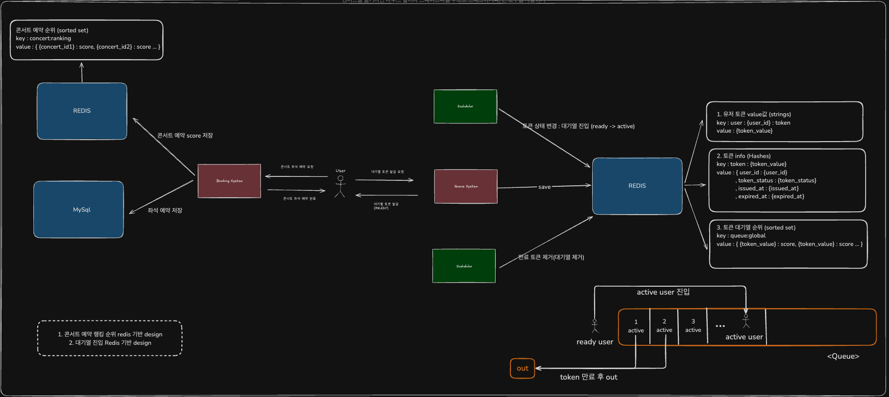
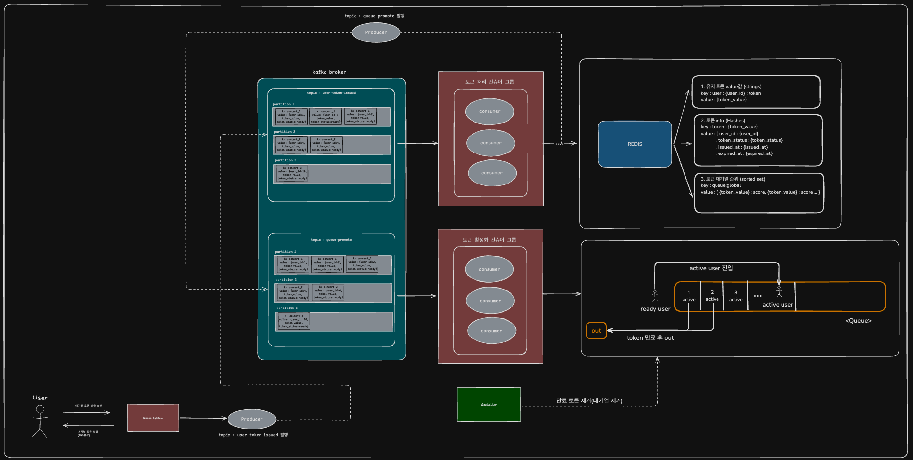

# 카프카 활용 비즈니스 프로세스 개선

## 목차
[1. 설계 목표](#1-설계-목표)

[2. 설계](#2-설계)

[3. 결론](#3-결론)

# ✏️ 1. 설계 목표
- 콘서트 예약 대기열 대량 요청 환경에서 사용자 대기열(Token)을 효율적으로 관리
- kafka 이벤트 기반 비동기 처리로 확장성과 성능 확보

## 📌 기존 프로세스의 한계점
- DB 또는 Redis Polling 기반 순차 처리 => 요청 폭주 시 부하 집중, 응답 지연 발생
- 대기열 토큰 관리 로직이 단일 트랜잭션 기반 => 확장 어려움, 병렬성 부족
- 사용자 상태 변화(READY→ACTIVE) 동기 로직 => 분산 환경에서 병목 가능성
- 스케줄러에 의한 완전한 비동기 처리의 한계

## 📌 개선 방향: Kafka 기반 비동기 대기열 처리
- 사용자 요청 시 대기열(Token) 생성 → Kafka 발행
- Kafka Consumer가 순차적으로 처리하며 Redis에 토큰 상태 갱신
- 상태 변화 활성화(READY → ACTIVE)는 Kafka, 만기(ACTIVE/READY -> EXPIRED) 스케줄러 처리

# ✏️ 2. 설계

## 📌 AS-IS
레디스 기반 대기열 설계
- 레디스 & 스케줄러를 통해 대기열 토큰 관리

## 📌 To-BE
카프카 이벤트 기반 대기열 설계
- 카프카 이벤트 발행을 통해 비동기 토큰 관리

# ✏️ 3. 결론

## 📌 성능 개선

- AS-IS : 유저 토큰 발급 요청 후 토큰 활성화까지 스케줄러를 통해 토큰 상태 변경(활성화 대상에 포함되기까지 최대 10초 소요)
- TO-BE : 유저 토큰 발급 요청 후 토큰 발급 카프카 이벤트 발행 -> 토큰 활성화 이벤트 발행 프로세스로 변경 (이벤트 처리 기반의 비동기 프로세스 구성)
