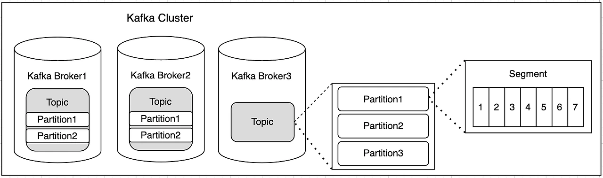
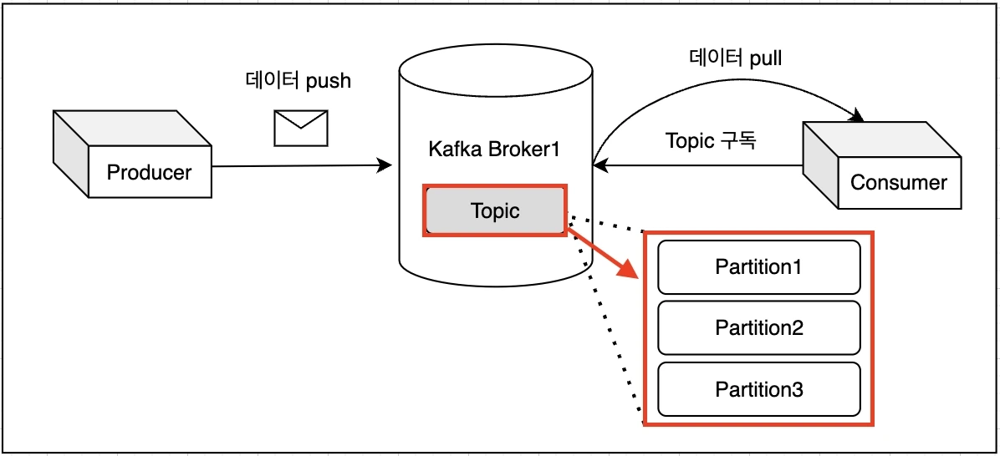

# 카프카 기초 학습 및 활용 보고서

## 목차
[1. 카프카 개념](#1-카프카-개념)

[2. 문제 해결](#2-문제-해결)

[3. 결론](#3-결론)

# ✏️ 1. 카프카 개념

Apache Kafka는 대용량의 실시간 로그 데이터를 처리하기 위한 분산 스트리밍 플랫폼입니다.  
본 보고서에서는 Kafka의 기본 개념, 주요 구성 요소, 메시지 전송 구조, 활용 방식 등을 학습하고, 이를 실제 애플리케이션에 적용한 내용을 정리합니다.

## 📌 1.1 카프카?
Kafka는 다음과 같은 특징을 가진 메시지 브로커입니다:

- 고성능 분산 메시징 시스템
- 실시간 스트리밍 데이터 처리 가능
- 데이터 영속성과 확장성 지원
- pub/sub 구조 기반 메시지 처리

## 📌 카프카 주요 구성 요소

| 구성 요소     | 설명 |
|--------------|------|
| **Producer** | Kafka로 메시지를 전송하는 클라이언트 |
| **Consumer** | Kafka로부터 메시지를 소비하는 클라이언트 |
| **Broker**   | 메시지를 저장하고 전달하는 Kafka 서버 |
| **Topic**    | 메시지가 전달되는 논리적인 채널 |
| **Partition**| Topic을 분할하여 병렬성과 확장성을 제공 |
| **Consumer Group** | 여러 Consumer가 병렬로 메시지를 처리할 수 있도록 그룹화 |

## 📌 메시지 전송 구조 및 파티션
Producer → [Kafka Topic Partition] → Consumer Group

- Producer는 특정 Topic으로 메시지를 보냄
- Kafka는 메시지를 Topic의 Partition에 분배
- Consumer는 해당 Partition으로부터 메시지를 읽음

- Apache Kafka에서 파티션(partition)은 데이터 처리를 효율적으로 하기 위한 핵심 요소
- 파티션은 큐를 나눠서 병렬 처리를 가능하게 하는 기본 단위이며, Kafka의 각 토픽(topic)은 하나 이상의 파티션으로 나눠져 있음
- 이를 통해 메시지가 병렬로 처리될 수 있음
- 다음과 같은 장점 존재
  - 병렬 처리: 여러 컨슈머(consumer)가 서로 다른 파티션에서 데이터를 동시에 읽을 수 있고, 이는 처리 속도를 크게 향상시킴
  - 순서 보장: 하나의 파티션 내에서는 메시지의 순서가 보장되어, 순차적인 데이터 처리가 필요할 때 유용함
  - 확장성: 파티션을 여러 노드에 분산시켜 저장할 수 있어서, 시스템의 확장성을 높일 수 있음

---

# ✏️ 2. 문제 해결

## 📌2-1. 도메인 분리 및 설계

---

# ✏️3. 결론

## 📌3-1.  MSA 설계 효과

[MSA 셜계 보고서 notion](https://www.notion.so/teamsparta/8-Transaction-Diagnosis-MSA-1f92dc3ef51480f6920df959e64ec3a5#feb95fc05a374562b82ceb61eff151e7)
