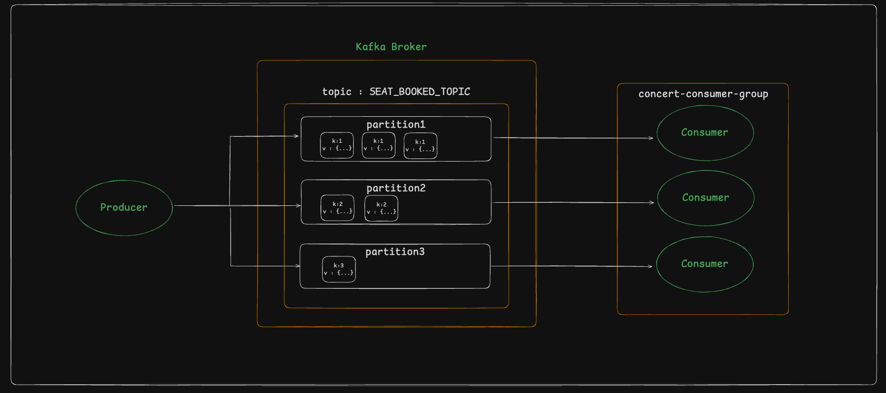

# 카프카 기초 학습 및 활용 보고서

## 목차
[1. 카프카 개념](#1-카프카-개념)

[2. 카프카 환경 셋팅 & 기본 기능 수행](#2-카프카-환경-셋팅-&-기본-기능-수행)

[3. 결론](#3-결론)


# ✏️ 1. 카프카 개념

Apache Kafka는 대용량의 실시간 로그 데이터를 처리하기 위한 분산 스트리밍 플랫폼입니다.  
본 보고서에서는 Kafka의 기본 개념, 주요 구성 요소, 메시지 전송 구조, 활용 방식 등을 학습하고, 이를 실제 애플리케이션에 적용한 내용을 정리합니다.

## 📌 1.1 카프카?
Kafka는 다음과 같은 특징을 가진 메시지 브로커입니다:

- 고성능 분산 메시징 시스템
- 실시간 스트리밍 데이터 처리 가능
- 데이터 영속성과 확장성 지원
- pub/sub 구조 기반 메시지 처리


## 📌 카프카 주요 구성 요소

| 구성 요소     | 설명 |
|--------------|------|
| **Producer** | Kafka로 메시지를 전송하는 클라이언트 |
| **Consumer** | Kafka로부터 메시지를 소비하는 클라이언트 |
| **Broker**   | 메시지를 저장하고 전달하는 Kafka 서버 |
| **Topic**    | 메시지가 전달되는 논리적인 채널 |
| **Partition**| Topic을 분할하여 병렬성과 확장성을 제공 |
| **Consumer Group** | 여러 Consumer가 병렬로 메시지를 처리할 수 있도록 그룹화 |

## 📌 메시지 전송 구조 및 파티션
Producer → [Kafka Topic Partition] → Consumer Group


- Producer는 특정 Topic으로 메시지를 보냄
- Kafka는 메시지를 Topic의 Partition에 분배
- Consumer는 해당 Partition으로부터 메시지를 읽음


- Apache Kafka에서 파티션(partition)은 데이터 처리를 효율적으로 하기 위한 핵심 요소
- 파티션은 큐를 나눠서 병렬 처리를 가능하게 하는 기본 단위이며, Kafka의 각 토픽(topic)은 하나 이상의 파티션으로 나눠져 있음
- 이를 통해 메시지가 병렬로 처리될 수 있음
- 다음과 같은 장점 존재
  - 병렬 처리: 여러 컨슈머(consumer)가 서로 다른 파티션에서 데이터를 동시에 읽을 수 있고, 이는 처리 속도를 크게 향상시킴
  - 순서 보장: 하나의 파티션 내에서는 메시지의 순서가 보장되어, 순차적인 데이터 처리가 필요할 때 유용함
  - 확장성: 파티션을 여러 노드에 분산시켜 저장할 수 있어서, 시스템의 확장성을 높일 수 있음

---

# ✏️ 2. 카프카 환경 셋팅 & 기본 기능 수행

## 📌2-1. 카프카 환경 셋팅

### Producer Config
```java
@Configuration
@EnableKafka
public class KafkaProducerConfig {

  @Bean
  public ProducerFactory<String, Object> factory() {
    Map<String, Object> props = new HashMap<>();
    props.put(ProducerConfig.BOOTSTRAP_SERVERS_CONFIG, "localhost:9092");
    props.put(ProducerConfig.KEY_SERIALIZER_CLASS_CONFIG, StringSerializer.class);
    props.put(ProducerConfig.VALUE_SERIALIZER_CLASS_CONFIG, JsonSerializer.class);

    return new DefaultKafkaProducerFactory<>(props);
  }

  @Bean
  public KafkaTemplate<String, Object> kafkaTemplate(){
    return new KafkaTemplate<>(factory());
  }
}

```

| 설정 키                        | 설명                                |
|-------------------------------|-------------------------------------|
| BOOTSTRAP_SERVERS_CONFIG      | Kafka 브로커 주소 (`localhost:9092`) |
| KEY_SERIALIZER_CLASS_CONFIG   | Key를 문자열로 직렬화                |
| VALUE_SERIALIZER_CLASS_CONFIG | Value를 JSON으로 직렬화             |

---

### Consumer Config
```java
@Configuration
@EnableKafka
public class KafkaConsumerConfig {

    //Kafka Consumer를 생성하는 데 필요한 설정 정보를 담은 팩토리
    public <T> ConsumerFactory<String, T> consumerFactory(Class<T> clazz, String groupId) {
        Map<String, Object> props = new HashMap<>();
        props.put(ConsumerConfig.BOOTSTRAP_SERVERS_CONFIG, "localhost:9092");
        props.put(ConsumerConfig.GROUP_ID_CONFIG, groupId);
        props.put(ConsumerConfig.KEY_DESERIALIZER_CLASS_CONFIG, StringDeserializer.class); //key 역직렬화
        props.put(ConsumerConfig.VALUE_DESERIALIZER_CLASS_CONFIG, JsonDeserializer.class); //value 역직렬화

        // true : Kafka가 주기적으로 자동으로 커밋(최신 메시지만 처리하려는 경우에는 유리)
        props.put(ConsumerConfig.ENABLE_AUTO_COMMIT_CONFIG, true);

        //Kafka에 현재 consumer group에 해당하는 offset이 없을 때 어디서부터 메시지를 읽을지를 결정
        //earliest : 가장 오래된 메시지부터 다시 읽기 시작 / latest : 가장 최근 메시지부터 읽기 시작
        props.put(ConsumerConfig.AUTO_OFFSET_RESET_CONFIG, "earliest");

        //한번에 최대 10개만 consume
        props.put(ConsumerConfig.MAX_POLL_RECORDS_CONFIG, 10);

        JsonDeserializer<T> jsonDeserializer = new JsonDeserializer<>(clazz);
        jsonDeserializer.addTrustedPackages("*");

        return new DefaultKafkaConsumerFactory<>(props, new StringDeserializer(), jsonDeserializer);
    }
    
    @Bean
    public ConsumerFactory<String, SeatBookedEvent> seatBookedConsumerFactory() {
      return consumerFactory(SeatBookedEvent.class, "concert-consumer-group");
    }
    
}
```

| 설정 키                        | 설명                                                               |
|-------------------------------|--------------------------------------------------------------------|
| BOOTSTRAP_SERVERS_CONFIG      | Kafka 브로커 주소                                                   |
| GROUP_ID_CONFIG               | Consumer가 속할 Group ID                                           |
| KEY_DESERIALIZER_CLASS_CONFIG | 메시지 Key 역직렬화 클래스                                         |
| VALUE_DESERIALIZER_CLASS_CONFIG | 메시지 Value 역직렬화 클래스                                    |
| ENABLE_AUTO_COMMIT_CONFIG     | 자동 오프셋 커밋 여부 (`true`: 주기적으로 자동 커밋)              |
| AUTO_OFFSET_RESET_CONFIG      | 오프셋이 없을 경우 읽기 시작 위치 (`earliest`: 가장 오래된 메시지부터) |
| MAX_POLL_RECORDS_CONFIG       | 한 번에 가져올 최대 메시지 수 (`10`)                              |


## 📌2-2. 카프카 기본 기능 수행
콘서트 예약 후 좌석 점유 이벤트 기반 기본 기능 구현

해당 기능은 Kafka를 통해 좌석 점유 이벤트를 비동기적으로 처리한다. 
Producer는 콘서트 ID를 메시지 Key로 사용해 Kafka Topic (`seat-booked-topic`)에 메시지를 전송하고, 이 Key를 기반으로 Kafka는 내부 해시 전략에 따라 3개의 파티션 중 하나에 메시지를 할당한다.

해당 파티션은 Consumer Group(`concert-consumer-group`) 내의 Consumer 인스턴스가 1:1로 처리하며,
이를 통해 메시지 순서 보장(같은 콘서트 ID는 같은 파티션에 저장), 병렬 처리 성능 확보(파티션 분산 처리) 등 Kafka의 기본 기능이 잘 활용되도록 구성한다.


- Kafka 토픽: seat_booked_topic
- 파티션 수: 3개
- 메시지 분배 기준: Concert ID를 key로 사용해서 Kafka의 내부 해시 전략에 따라 자동 분배

### Kafka의 파티션-컨슈머 매핑 원칙 정리
1. 동일 consumer group 내에서, 각 파티션은 오직 하나의 컨슈머 인스턴스만 처리 가능(1:1) / 하나의 컨슈머는 여러 파티션을 맡을 수 있음 (1:N)
2. 컨슈머 수 == 파티션 수일 경우 일반적으로 1:1로 매칭
- 하지만 어떤 컨슈머가 어떤 파티션을 받을지는 Kafka가 내부적으로 리밸런싱 하며 결정
- 즉, 파티션 0은 항상 consumer-0에게 간다 같은 보장은 없음
3. 컨슈머가 재시작되거나 수가 바뀌면 Kafka는 자동으로 **리밸런싱(rebalancing)**을 수행하고, 파티션 할당을 재분배
- 이 과정은 Kafka가 Zookeeper나 Kafka 자체의 group coordinator를 통해 조율

### 코드 구현

```java
/*
 좌석 점유 처리 이벤트 발행 -> 기존 어플리케이션이벤트 기반에서 카프카 이벤트 발행으로 변경
*/
bookingEventPublisher.success(new SeatBookedEvent(seat, seat.getConcertSeat()));
```

```java
/*
    카프카 publisher에서 이벤트 send
*/
@Component
@RequiredArgsConstructor
@Slf4j
public class KafkaBookingEventPublisher implements BookingEventPublisher {

    private final KafkaTemplate<String, Object> kafkaTemplate;
    private static final String SEAT_BOOKED_TOPIC = "seat-booked-topic";

    @Override
    public void success(SeatBookedEvent event) {

        //key 값에 따라 메시지가 각기 다른 파티션으로 분배되게. (콘서트 별로 key 구성 -> 자동으로 kafkaTemplate이 hash 변환)
        //kafkaTemplate.send(SEAT_BOOKED_TOPIC, key, event);
        String key = String.valueOf(event.getSeat().getConcertSeat().getConcert().getConcertId());
        kafkaTemplate.send(SEAT_BOOKED_TOPIC, key, event);
        log.info("-----Kafka sent SeatBookedEvent with key={} : {}-----", key, event);
    }
}
```

```java
/*
    카프카 consumer listener 통해 발행 이벤트 수행
*/
@Component
@RequiredArgsConstructor
@Slf4j
public class SeatBookedKafkaConsumer {

    private final SeatRepository seatRepository;

    @KafkaListener(topics = "seat-booked-topic", groupId = "concert-consumer-group", containerFactory = "seatBookedListenerContainerFactory")
    @Transactional
    public void consumeSeatBookedEvent(SeatBookedEvent event) {
        try {
            log.info("-----Kafka Consumer received SeatBookedEvent: {} -----", event);

            Seat seat = event.getSeat();
            seat.setSeatStatus(SeatStatus.OCCUPIED);
            seat.setConcertSeat(event.getConcertSeat());
            seatRepository.save(seat);

        } catch (SeatException e) {
            log.error("Error handling SeatBookedEvent: {}", e.getStatus(), e);
            throw e;
        }
    }
}
```


# ✏️3. 결론
Kafka를 도입함으로써 시스템은 메시지 기반의 비동기 구조로 전환되었고, 어플리케이션 내에서 Kafka를 활용해 메시지의 발행과 소비를 안정적으로 처리할 수 있도록 구현하였다.

Kafka는 파티셔닝과 Consumer Group 구조를 통해 대규모 이벤트의 병렬 처리와 메시지 순서 보장을 동시에 달성할 수 있는 구조를 제공하며, 이를 통해 이벤트 처리 시스템의 확장성과 신뢰성을 효과적으로 확보할 수 있음을 확인하였다.